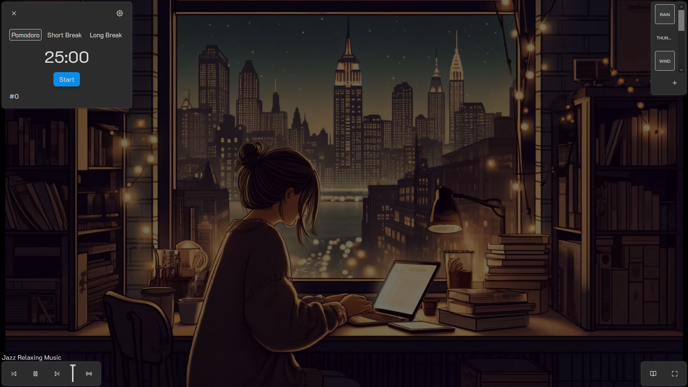
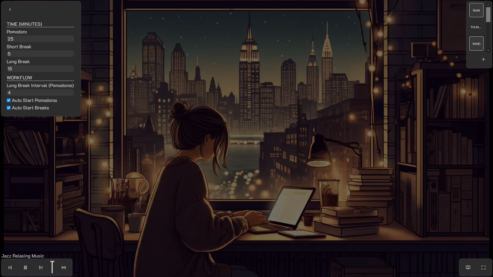
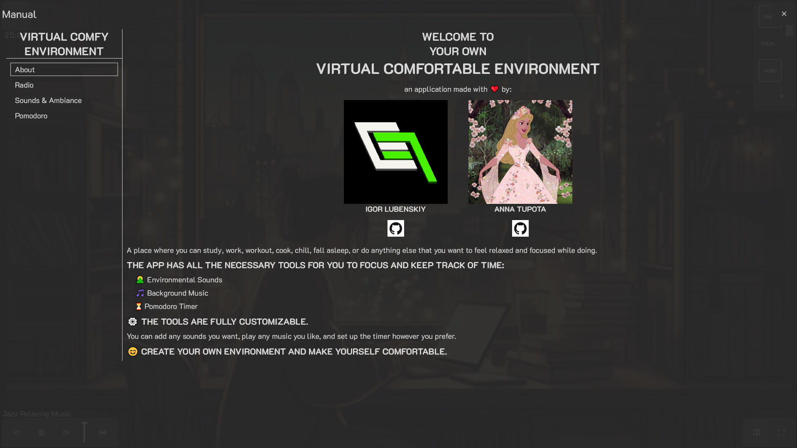

# ☀️ Welcome to Your Own Virtual Comfortable Environment ☀️

A place where you can study, work, workout, cook, chill, fall asleep, or do anything else that you want to feel relaxed and focused while doing.

### The app has all the necessary tools for you to focus and keep track of time:
- 🌄 Environmental Sounds
- 🎵 Background Music
- ⏳ Pomodoro Timer

📖 You can read about all of the features and how to use them in our comprehensive manual inside the app.

### ⚙️ The tools are fully customizable.

You can add any sounds you want, play any music you like, and set up the timer however you prefer.

### 😊 Create your own environment and make yourself comfortable.

The app is available here: <GHPages-Link>

## 📷 Screenshots

### App General View

### List of Sounds

### List of Music Radio Stations

### Unfold Pomodoro Timer

### Pomodoro Timer Settings

### Manual General View

